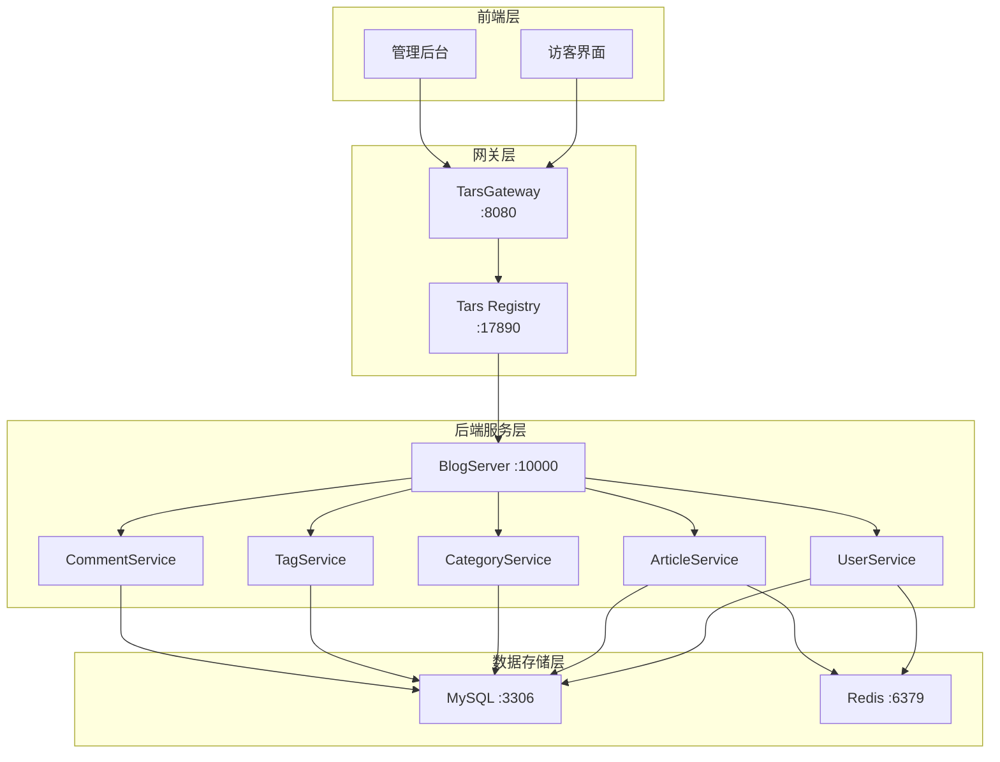

# Sajuna Blog

<div align="center">


基于 **Vue3 + Go + Tars 微服务** 的个人博客系统

[完整文档](docs/sajuna_blog开发文档.md)

</div>

---

## ✨ 特性

- 🚀 **现代化技术栈** - Vue3 + Composition API + TypeScript + Go 1.23
- 🏗️ **微服务架构** - 基于 Tars 框架的分布式微服务设计
- 🎨 **响应式设计** - 完美适配桌面端、平板、移动端
- 🐳 **容器化部署** - Docker Compose 一键启动，开箱即用
- ⚡ **高性能** - Redis 缓存 + MySQL 优化索引
- 🔒 **安全可靠** - JWT 认证 + bcrypt 加密 + SQL 注入防护
- 📝 **Markdown 支持** - 强大的 Markdown 编辑器，支持代码高亮
- 💬 **评论系统** - 支持二级评论和评论管理
- 🔍 **全文搜索** - 快速检索文章内容
- 📊 **数据统计** - 文章浏览量、点赞、评论统计

---

## 🛠️ 技术栈

### 前端

| 技术 | 版本 | 说明 |
|------|------|------|
| Vue 3 | ^3.4.0 | 渐进式 JavaScript 框架 |
| TypeScript | ^5.3.3 | JavaScript 超集，类型安全 |
| Pinia | ^2.1.7 | Vue 状态管理 |
| Vue Router | ^4.2.5 | 官方路由管理器 |
| Element Plus | ^2.4.4 | Vue3 UI 组件库 |
| Axios | ^1.6.0 | HTTP 客户端 |
| Vite | ^5.0.8 | 下一代前端构建工具 |

### 后端

| 技术 | 版本 | 说明 |
|------|------|------|
| Go | 1.23+ | 高性能编程语言 |
| Tars | latest | 腾讯开源微服务框架 |
| GORM | 1.25+ | Go ORM 库 |
| JWT | v5.2.0 | JSON Web Token |
| Viper | 1.17+ | 配置管理 |
| bcrypt | - | 密码加密 |

### 基础设施

| 服务 | 版本 | 说明 |
|------|------|------|
| MySQL | 8.0 | 关系型数据库 |
| Redis | 7-alpine | 内存数据库 |
| Nginx | alpine | 反向代理服务器 |
| Docker | 28.4.0+ | 容器化平台 |

---

## 🚀 快速开始

---

## 📁 项目结构

```
sajunaBlog/
├── frontend/                 # 前端项目
│   ├── src/
│   │   ├── api/             # API 接口
│   │   ├── components/      # 公共组件
│   │   ├── views/           # 页面组件
│   │   ├── router/          # 路由配置
│   │   ├── stores/          # Pinia 状态管理
│   │   └── styles/          # 全局样式
│   ├── Dockerfile           # 前端 Docker 配置
│   └── package.json         # 前端依赖
│
├── backend/                  # 后端项目
│   ├── api/                 # Tars IDL 定义
│   ├── cmd/                 # 主程序入口
│   │   └── blog_server/
│   ├── internal/            # 内部包
│   │   ├── config/         # 配置管理
│   │   ├── database/       # 数据库连接
│   │   ├── model/          # 数据模型
│   │   ├── service/        # 业务逻辑
│   │   └── utils/          # 工具函数
│   ├── configs/            # 配置文件
│   ├── Dockerfile          # 后端 Docker 配置
│   └── go.mod              # Go 依赖
│
├── configs/                 # 全局配置
│   ├── init.sql            # 数据库初始化脚本
│   └── tars-gateway.conf   # Tars 网关配置
│
├── docs/                    # 项目文档
│   ├── sajuna_blog开发文档.md
│   ├── API文档.md
│   ├── Tars架构说明.md
│   └── 项目结构说明.md
│
├── scripts/                 # 脚本工具
│   ├── sajuna-blog.bat     # Windows 启动脚本
│   └── db-connect.bat      # 数据库连接脚本
│
├── docker-compose.yml       # Docker Compose 配置
├── .gitignore              # Git 忽略文件
└── README.md               # 项目说明（本文件）
```

---

## 📚 核心功能

### 访客端

-  **文章浏览** - 首页、列表页、详情页
-  **分类/标签** - 按分类和标签筛选文章
-  **搜索功能** - 全文检索文章内容
-  **评论系统** - 发表评论、二级回复
-  **响应式设计** - 移动端适配

### 管理端

-  **文章管理** - 创建、编辑、删除、发布文章
-  **Markdown 编辑器** - 实时预览、代码高亮
-  **分类/标签管理** - 组织文章结构
-  **评论管理** - 审核、回复、删除评论
-  **数据统计** - 文章浏览量、评论数统计

### 待开发功能 🚧

- 🔲 **AI 自动摘要** - 使用大模型自动生成文章摘要
- 🔲 **朋友圈功能** - RSS 订阅友链动态聚合
- 🔲 **黑暗模式** - 主题切换
- 🔲 **国际化** - 多语言支持
- 🔲 **图片上传** - 支持图片管理

---

## 🏗️ 系统架构



---

## 📖 文档

- 📘 [完整开发文档](docs/sajuna_blog开发文档.md)
- 📗 [API 接口文档]***
- ***

---

## 🔧 开发指南

### 环境要求

- Node.js ≥ 20.11.0 LTS
- Go ≥ 1.23.0
- MySQL ≥ 8.0
- Redis ≥ 7.0

详细配置请参考 [开发文档](docs/sajuna_blog开发文档.md#环境搭建)

---

## 🤝 贡献

欢迎贡献代码！请遵循以下步骤：

1. Fork 本仓库
2. 创建特性分支 (`git checkout -b feature/AmazingFeature`)
3. 提交更改 (`git commit -m 'feat: Add some AmazingFeature'`)
4. 推送到分支 (`git push origin feature/AmazingFeature`)
5. 提交 Pull Request

### 提交规范

本项目遵循 [Conventional Commits](https://www.conventionalcommits.org/) 规范：

- `feat`: 新功能
- `fix`: 修复 Bug
- `docs`: 文档更新
- `style`: 代码格式调整
- `refactor`: 重构
- `perf`: 性能优化
- `test`: 测试相关
- `chore`: 构建/工具变动

---

## 🗺️ 开发路线图

### v0.1.0（当前版本）
- [x] 基础框架搭建
- [x] 用户认证系统
- [x] 文章 CRUD
- [x] 评论系统
- [x] Docker 部署

### v0.2.0（开发中）
- [ ] AI 自动摘要功能
- [ ] 分布式朋友圈（RSS 聚合）
- [ ] 搜索优化
- [ ] 性能优化

### v1.0.0（计划中）
- [ ] 暗黑模式
- [ ] 国际化支持
- [ ] 图片管理
- [ ] SEO 优化
- [ ] 数据分析面板

---

## 📊 项目状态

| 模块 | 状态 |
|------|------|
| 前端框架 | 🔴 |
| 后端服务 | 🔴 |
| 数据库设计 | 🔴 |
| API 接口 | 🔴 |
| 文档完善 | 🔴 |
| 测试覆盖 | 🔴 |

---

## 👥 作者

**Sajuna**

- GitHub: [@scuhiiragishinoa](https://github.com/scuhiiragishinoa)
- Email: sajunabss@qq.com

---

<div align="center">

**[⬆ 回到顶部](#sajuna-blog)**

</div>
