# Sajuna Blog 开发文档
**2025年11月3日** - 0.2.0

---

## 一、项目概述

### 1.1 项目目标
本项目旨在构建一个现代化的、功能丰富的校园BBS论坛。论坛将围绕版块 (Board) 进行内容组织，以主题 (Thread) 和回帖 (Reply) 作为核心互动形式，并集成先进的AI辅助功能、个性化信息流与强大的社区治理工具，旨在为校园用户提供一个活跃、健康、高效的交流与知识沉淀空间。

### 1.2 核心定位
- 从个人发布到社区共建：核心从单一作者的内容输出转变为所有注册用户的共同创造和讨论。
- 结构化讨论空间：以“版块”为单位划分兴趣区，方便用户快速定位和参与特定领域的讨论。
- 双重信息流：同时提供基于版块的公共内容流和基于用户关注的个性化Feed流。
- AI赋能：利用AI技术对帖子内容进行摘要、构建知识库，提升信息检索与消费效率。
- 校园特色：深度集成校园身份认证（SSO），并提供匿名/实名发帖选项以适应校园文化。

---

## 二、部署说明

本项目使用 Docker 进行容器化部署，采用前后端分离架构设计：

- **前端**：使用 Vue3 框架，采用响应式设计适配移动端，在 [localhost:3000](http://localhost:3000) 端口上进行开发
- **后端**：使用 Go + Tars 微服务框架 + GORM，通过 TarsGateway 提供 HTTP API 服务，在 [localhost:8080](http://localhost:8080) 上运行
- **数据库**：使用 [MySQL](http://localhost:3306) + [Redis](http://localhost:6379)
- **网关**：使用 [Nginx](http://localhost:80) 进行反向代理

### 前端技术栈

前端采用 Vue 进行开发，致力于为用户提供一个友好且高效的交互式网页界面。

| 技术栈 | 说明 |
|--------|------|
| Vue 3 | 采用 Composition API 提升组件复用性与逻辑组织能力 |
| Pinia | 全局状态管理 |
| Vue Router 4.x | 实现灵活的页面路由控制 |
| Element Plus UI 组件库 | 丰富的 UI 组件支持 |
| Sass/SCSS 预处理器 | 增强 CSS 开发能力 |
| Axios | HTTP 通信 |
| WebSocket + STOMP.js | 实现消息的即时推送与接收 |

### 后端架构

后端基于 Tars 微服务框架，使用 TarsGateway 作为 API 网关，提供统一的 HTTP 接口。TarsGateway 负责请求路由、负载均衡、限流熔断等功能。系统通过 Tars 框架实现服务注册发现、监控管理等功能。

### 底层服务

底层依托以下技术栈构建：

- **MySQL**：核心数据存储
- **Redis**：缓存相关数据，提升系统性能
- **MinIO**：提供分布式文件存储服务
- **Kafka**：作为消息队列支撑 Chatservice 的高并发消息分发，保证即时通讯稳定性与可扩展性

整体系统具备良好的模块解耦、水平扩展与高可用能力，可支持用户规模增长下的稳定运行，满足知识管理平台在实际应用中的业务需求。

### 环境搭建

#### Docker 部署

##### 1. 安装 Docker Desktop

**版本要求：**
- **Docker Desktop**: ≥ 28.4.0
- **Docker Engine**: ≥ 27.0.0
- **Docker Compose**: ≥ v2.28.0

**Windows 安装：**
```powershell
# 1. 下载 Docker Desktop for Windows (https://www.docker.com/products/docker-desktop/)

# 2. 启用 WSL 2（如果还未启用）
wsl --install

# 3. 重启电脑后，安装 Docker Desktop
# 双击安装包，按提示安装

# 4. 验证安装
docker --version
# 输出：Docker version 27.x.x, build xxx

docker compose version
# 输出：Docker Compose version v2.28.x
```

##### 2. 启动项目

##### 3. 访问应用

| 服务 | 地址 | 说明 |
|-----|------|------|
| **前端** | http://localhost:3000 | 博客主页 |
| **后端 API** | http://localhost:8080 | TarsGateway API 网关 |
| **Tars Registry** | http://localhost:17890 | Tars 注册中心 |
| **MySQL** | localhost:3306 | 数据库 |
| **Redis** | localhost:6379 | 缓存服务 |

#### 环境版本总结

**Docker 部署：**
| 组件 | 版本 | 说明 |
|------|------|------|
| Docker Desktop | ≥ 28.4.0 | 容器平台 |
| Docker Engine | ≥ 27.0.0 | Docker 引擎 |
| Docker Compose | ≥ v2.28.0 | 容器编排工具 |


**容器镜像版本（docker-compose.yml）：**
| 服务 | 镜像 | 版本 |
|------|------|------|
| MySQL | mysql | 8.0 |
| Redis | redis | 7-alpine |
| Tars | tarscloud/tars | v3.0.20 |
| Node.js (构建) | node | 22.20.0 LTS |
| Nginx | nginx | alpine |
| Go (构建) | golang | 1.25.1 |

---

## 三、需求描述

### 用户角色与画像

系统包含以下四类核心用户角色。

| 角色 | 核心目标 | 典型场景 |
| :--- | :--- | :--- |
| 访客 (Guest) | 1. 浏览公开版块的内容。<br>2. 了解社区的热门话题。<br>3. 搜索公开信息。 | 通过链接或首页进入BBS，浏览“校园热榜”和公开版块（如“新生咨询”），阅读感兴趣的帖子，但无法发帖或回复。 |
| 普通用户 (Registered User) | 1. 在授权版块发布主题帖、回复他人。<br>2. 关注感兴趣的用户和版块，构建个性化信息流。<br>3. 对帖子和回帖进行点赞、收藏、举报等互动。<br>4. 管理个人主页和发布过的内容。 | 每日登录，查看“我的关注”和版块更新。在“课程交流区”提问，在“二手市场”发布交易帖。看到不当言论时使用举报功能。 |
| 版主 (Board Moderator) | 1. 维护所管辖版块的讨论氛围。<br>2. 管理版块内的帖子（置顶、加精、删除、移动）。<br>3. 处理版块内的用户举报。<br>4. 发布版块公告。 | 登录后进入版主后台，审核待处理的举报信息。将一篇高质量的技术分享帖设置为“精华”。将一篇违规帖子删除，并记录操作日志。 |
| 全站管理员 (Site Administrator) | 1. 维护整个BBS的稳定与安全。<br>2. 创建、编辑、删除版块。<br>3. 任命或撤销版主。<br>4. 管理所有用户账号与权限。<br>5. 配置全局系统参数（如敏感词、限流策略）。 | 根据社区发展需要，创建新的“人工智能”版块并指定版主。处理升级的用户申诉。查看系统仪表盘，监控站点健康状况。 |

---

### 功能需求 (Functional Requirements)

#### F1: 核心社区功能

此模块构成BBS内容与结构的基础。

*   F1.1 版块体系 (Board System)
    *   版块列表页：以卡片或列表形式展示所有版块，包含版块图标、名称、简介、今日帖数等信息。
    *   版块详情页 (主题列表)：分页展示指定版块下的所有主题帖。支持按“最新发布”、“最新回复”、“热门”等方式排序。置顶帖和精华帖有特殊标识。

*   F1.2 主题与回帖系统 (Thread & Reply System)
    *   主题详情页 (ThreadDetail)：展示帖子的完整内容，包括标题、作者（可匿名）、发布时间、正文、附件、投票（如有），以及所有回帖列表。
    *   发布/编辑主题：提供强大的富文本或Markdown编辑器。用户可选择发布的版块、添加标题、正文、标签、图片/附件，并选择是否匿名。支持草稿自动保存。
    *   发布/编辑回帖：在主题详情页下方，用户可以对主楼或其它楼层进行回复，形成评论树。

*   F1.3 校园特色功能
    *   匿名/实名模式：用户在发帖或回帖时，可选择使用实名身份或匿名身份（如“匿名用户A”）。匿名身份在社区前端对普通用户不可见，但对管理员和版主后台可溯源。
    *   投票功能 (Poll)：发布主题帖时可附加一个投票，设定单选/多选、截止时间等。

#### F2: 互动与治理

此模块增强社区的活跃度并保障社区秩序。

*   F2.1 用户互动
    *   点赞/收藏：用户可以对主题帖和回帖进行点赞或收藏。
    *   关注用户/版块：用户可以关注其他用户或特定版块，其动态将出现在个人信息流中。

*   F2.2 社区治理
    *   举报系统：用户可对违规的帖子或回帖发起举报，并填写理由。举报信息进入版主或管理员的审核后台。
    *   敏感词过滤：系统自动过滤帖子和回帖中的敏感词汇。
    *   操作日志 (Moderation Log)：版主和管理员的所有管理操作（如删帖、禁言）都将被记录，以备审计。

#### F3: 个人与信息流

此模块为用户提供个性化的内容消费体验。

*   F3.1 全站信息流
    *   广场 (Discovery)：聚合全站的热门帖子和优质内容，作为新用户发现内容的入口。
    *   热榜 (Hot Board)：基于算法（如帖子热度、回复数、点赞数）生成全站或特定版块的热门话题排行榜。

*   F3.2 个人化信息流 (Personalized Feed)
    *   动态时间线 (Timeline)：基于用户关注的“人”和“版块”，聚合生成个性化的动态流。此功能保留并适配了原有的Feed流设计。
    *   通知中心 (Notifications)：当用户的帖子/回帖被回复、点赞、@时，或关注的用户发布新帖时，系统会发送站内通知。

*   F3.3 用户中心 (User Profile)
    *   展示用户的基本信息、发布过的主题、收到的赞等。
    *   提供账号设置、隐私设置、通知设置等功能。

#### F4: 搜索与AI助手

此模块利用AI技术提升信息处理和检索的效率。

*   F4.1 全局搜索 (Global Search)
    *   支持在全站范围内搜索主题、回帖、用户。
    *   支持关键词搜索，并可通过版块、时间范围等进行过滤。

*   F4.2 AI摘要 (AI Summary)
    *   主题摘要：系统自动为较长的主题帖生成内容摘要，在主题列表页和信息流中展示，提升浏览效率。
    *   回帖摘要：可对一个帖子的所有回帖进行总结，提炼出关键观点。

*   F4.3 知识库 (Knowledge Base)
    *   内容沉淀：版主或管理员可以将高质量的主题帖（如技术教程、课程攻略）一键沉淀到校园知识库中。
    *   语义检索：用户可以在知识库中进行自然语言提问，系统通过向量搜索找到最相关的内容片段，并提供原文链接。

#### F5: 管理功能 (Admin/Moderator Panel)

提供给版主和全站管理员的后台管理系统。

*   F5.1 身份认证 (Auth)
    *   登录/登出：支持账号密码登录及校园统一身份认证 (CAS/OAuth2 SSO)。
    *   权限控制：基于角色的访问控制（RBAC），严格区分不同角色的操作权限。

*   F5.2 版主后台 (Board Moderator Panel)
    *   内容管理：查看并处理管辖版块内的帖子（置顶、加精、删除、高亮）。
    *   举报处理：审核并处理来自用户的举报请求。
    *   用户管理：对版块内违规用户进行短期禁言等操作。
    *   版块公告：发布和管理版块内的公告。

*   F5.3 全站管理后台 (Site Admin Panel)
    *   系统仪表盘：展示站点核心数据，如日活用户、发帖量、服务器状态等。
    *   用户管理：管理全站所有用户，包括角色分配和处罚。
    *   版块管理：创建、编辑、删除版块，调整版块顺序。
    *   版主任命：任命或撤销用户的版主资格。
    *   系统配置：管理敏感词库、配置全局公告、设置内容推荐算法参数等。

---

### 非功能需求 (Non-Functional Requirements)

非功能需求已根据BBS的高并发、强互动场景进行全面升级。

| 类别 | 需求描述 |
| :--- | :--- |
| N1: 性能 | 页面加载速度: 核心页面（首页、版块页）首屏加载时间 < 1.5s。<br>API响应速度: P95响应时间 < 100ms（缓存命中时），< 300ms（穿透DB时）。<br>并发支持: 支持至少 2000 个并发用户在线。<br>事件流延迟: 帖子扇出到关注者信息流的延迟 P95 < 500ms。<br>AI任务: AI摘要生成时间 < 5s，不阻塞主流程。 |
| N2: 安全性 | Web安全: 防御SQL注入、XSS（DOMPurify）、CSRF等。所有用户输入都需经过严格校验和清洗。<br>认证与授权: 用户密码使用`bcrypt`加盐哈希存储。JWT Token生命周期短，配合Refresh Token机制。所有API接口均需鉴权。<br>API防护: 实施基于用户和IP的双重速率限制，防止恶意刷帖和API滥用。<br>匿名机制: 匿名发帖后台必须可溯源，防止滥用。对异常高频的匿名行为自动降权或冷却。<br>数据安全: 敏感信息（如学号）在数据库中加密存储。 |
| N3: 可用性 | 响应式设计: 确保在手机、平板、PC端均有良好的、一致的用户体验。<br>无障碍访问: 遵循WCAG标准，支持键盘导航和屏幕阅读器。<br>用户引导: 界面简洁直观，新用户引导清晰。管理后台操作流程顺畅。 |
| N4: 可靠性 | 系统可用性: 目标 99.95% 的可用性，核心服务具备冗余和故障转移能力。<br>数据持久性: 核心数据（用户、帖子、回帖）必须有定期备份和恢复方案，确保不丢失。<br>消息队列: 保证消息传递的幂等性（Exactly-once或At-least-once + 消费者幂等），失败任务进入死信队列并告警。 |
| N5: 可维护性与可扩展性 | 微服务架构: 后端服务按领域清晰切分（如User, Board, Thread, Search, AI等），通过API网关通信。<br>代码质量: 遵循统一的编码规范，具备高测试覆盖率和完善的文档。<br>配置中心: 所有环境相关的配置（API Key, DB连接等）均通过配置中心管理，实现动态更新。<br>可观测性: 完善的日志（Logging）、指标（Metrics）和链路追踪（Tracing）体系。 |
| N6: 用户体验 | 加载体验: 广泛使用骨架屏和懒加载技术。<br>阅读体验: 长帖提供阅读进度条和“返回顶部”按钮。<br>个性化: 支持主题切换（日间/夜间模式）和语言国际化（初期以中文为主）。 |

---

### 5. 数据模型 (Data Model)

| 表名 (实体) | 字段 | 描述 |
| :--- | :--- | :--- |
| User | `id`, `username`, `hashed_password`, `email`, `student_id_encrypted`, `role`, `status`, `created_at` | 用户表，`role`定义为普通用户、管理员等。 |
| Board | `id`, `name`, `description`, `icon_url`, `parent_id`, `sort_order`, `status` | 版块表，支持层级结构。 |
| BoardModerator | `id`, `board_id`, `user_id`, `created_at` | 版主关系表，关联用户和版块。 |
| Thread | `id`, `board_id`, `author_id`, `title`, `content`, `summary_ai`, `status`, `is_pinned`, `is_essence`, `is_anonymous`, `view_count`, `reply_count`, `like_count`, `created_at` | 主题帖表。`author_id`记录真实发帖人。 |
| Reply | `id`, `thread_id`, `author_id`, `parent_id`, `content`, `is_anonymous`, `like_count`, `floor_number`, `created_at` | 回帖表。`parent_id`用于构建评论树。 |
| Follow | `id`, `follower_id`, `followee_id`, `follow_type` | 关注关系表。`follow_type`区分关注的是用户还是版块。 |
| Like | `id`, `user_id`, `target_id`, `target_type` | 点赞表。`target_type`区分是帖子还是回帖。 |
| Report | `id`, `reporter_id`, `target_id`, `target_type`, `reason`, `status`, `handler_id` | 举报记录表。 |
| KnowledgeBase | `id`, `name`, `description`, `owner_id`, `visibility` | 知识库表。 |
| KBDocument | `id`, `kb_id`, `source_type`, `source_id`, `title`, `meta_json` | 知识库文档，`source_id`关联到`Thread` ID。 |
| KBChunk | `id`, `doc_id`, `content`, `embedding_vector` | 知识库文本切片与向量。 |
...

---

### 核心接口 (Core APIs)

API设计遵循RESTful风格，并按资源进行组织。

```
// API Gateway Prefix: /api/v1

// --- Board ---
GET    /boards                  // 获取所有版块列表
GET    /boards/{board_id}         // 获取特定版块信息
GET    /boards/{board_id}/threads // 获取版块下的主题帖列表 (支持分页, 排序)

// --- Thread ---
POST   /threads                   // 创建新主题帖 (body: board_id, title, content, is_anonymous)
GET    /threads/{thread_id}       // 获取主题帖详情及其回帖
PUT    /threads/{thread_id}       // 更新主题帖
DELETE /threads/{thread_id}       // 删除主题帖 (仅作者或管理员)

// --- Reply ---
POST   /threads/{thread_id}/replies // 创建新回帖 (body: content, parent_id, is_anonymous)
DELETE /replies/{reply_id}          // 删除回帖 (仅作者或管理员)

// --- Interaction ---
POST   /interact/like               // 点赞 (body: target_id, target_type)
DELETE /interact/like               // 取消点赞 (body: target_id, target_type)
POST   /interact/follow             // 关注 (body: followee_id, follow_type)
DELETE /interact/follow             // 取消关注 (body: followee_id, follow_type)
POST   /interact/report             // 举报 (body: target_id, target_type, reason)

// --- Feed & User ---
GET    /feed/timeline             // 获取个人化时间线
GET    /feed/hotboard             // 获取全站或版块热榜
GET    /users/{user_id}           // 获取用户公开信息
GET    /me                        // 获取当前登录用户信息

// --- Search & AI ---
GET    /search                    // 全局搜索 (params: q, type, board_id)
GET    /kb/{kb_id}/search         // 在知识库中进行语义搜索 (params: query)

// --- Admin ---
POST   /admin/boards              // 创建新版块
PUT    /admin/boards/{board_id}   // 更新版块信息
POST   /admin/boards/{board_id}/moderators // 任命版主
POST   /admin/threads/{thread_id}/pin // 置顶帖子
POST   /admin/reports/{report_id}/handle // 处理举报
...
```

---

### 迁移与实施策略

项目将分阶段实施，确保平稳过渡和风险可控。

1.  阶段一：核心框架搭建 (MVP)
    *   目标：实现BBS最基础的浏览和发帖功能。
    *   内容：完成`User`, `Board`, `Thread`, `Reply`的数据模型与相关接口。实现用户注册登录、版块列表、主题列表、主题详情页的开发。
    *   验收：用户可以正常发帖和回复。

2.  阶段二：互动与治理体系
    *   目标：上线社区互动和基础管理功能。
    *   内容：开发点赞、收藏、关注功能。实现举报系统和版主后台，提供删帖、置顶、加精等操作。集成敏感词过滤。开发个人化Feed流和热榜缓存。
    *   验收：版主可以管理版块，用户可以进行有效的社区互动。

3.  阶段三：AI与搜索集成
    *   目标：引入AI能力，提升信息效率。
    *   内容：对接AI服务，实现主题帖的自动摘要。构建知识库沉淀和语义检索功能。优化全局搜索，支持多维度筛选。
    *   验收：长帖自动生成摘要，优质内容可被沉淀并能通过自然语言搜索。

4.  阶段四：校园生态整合
    *   目标：深度融入校园环境。
    *   内容：对接校园统一身份认证（SSO）。完善匿名发布策略。根据需求开设社团、课程等专属版块。构建完善的站内通知中心。
    *   验收：支持学号登录，社区生态与校园生活紧密结合。

---

### 风险与对策

| 风险类别 | 风险描述 | 应对策略 |
| :--- | :--- | :--- |
| 内容滥用 | 大量垃圾广告、恶意灌水、人身攻击等内容的出现，破坏社区氛围。 | 1. 技术手段：实施严格的IP敏感API限流、敏感词过滤。 <br>2. 社区治理：建立高效的“用户举报 -> 版主处理 -> 管理员审计”闭环流程。<br>3. 规则明确：公示清晰的社区规范。 |
| 匿名滥用 | 用户利用匿名功能发布不实信息或进行人身攻击。 | 1. 后台溯源：确保所有匿名行为在后台对管理员可见。<br>2. 策略限制：对新注册用户或高危版块限制匿名功能。<br>3. 行为分析：对异常高频的匿名发帖行为进行自动降权或临时冷却。 |
| 数据与性能 | 随着用户和内容量激增，导致数据库查询缓慢，页面加载延迟。 | 1. 架构设计：采用读写分离、冷热数据分层策略。<br>2. 缓存策略：对热点数据（如热榜、热门帖子）进行多级缓存。<br>3. 存储扩展：使用专业的搜索引擎（Elasticsearch）和向量数据库（Milvus/PGVector）分担主数据库压力。 |
| 开发复杂度 | 微服务架构、事件驱动、AI集成等引入了较高的技术复杂度和维护成本。 | 1. 领域驱动设计(DDD)：确保服务边界清晰。<br>2. 标准化：统一API契约（OpenAPI）、日志格式和监控指标。<br>3. 自动化：建立完善的CI/CD流水线和自动化测试，确保交付质量。 |


## 四、模块和关系

### 博客系统整体架构图

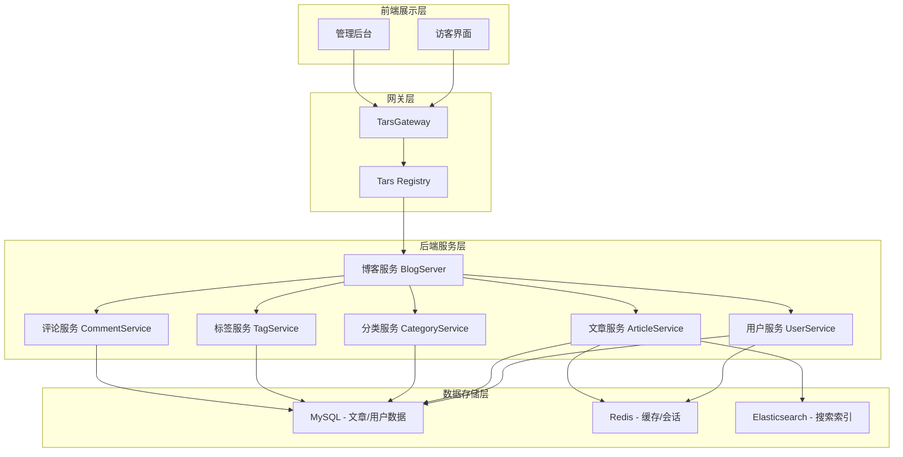

### 流程图

#### 访客浏览文章流程


#### 管理员文章CRUD操作流程

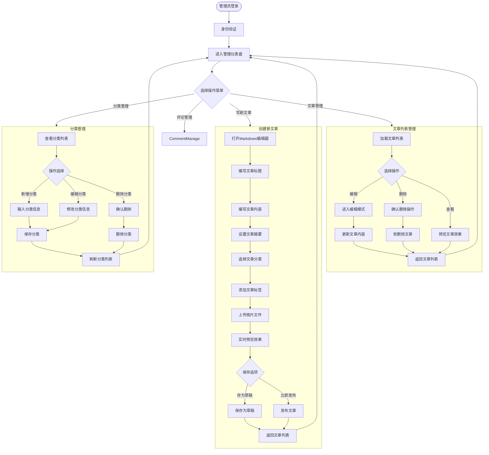

#### 评论系统流程

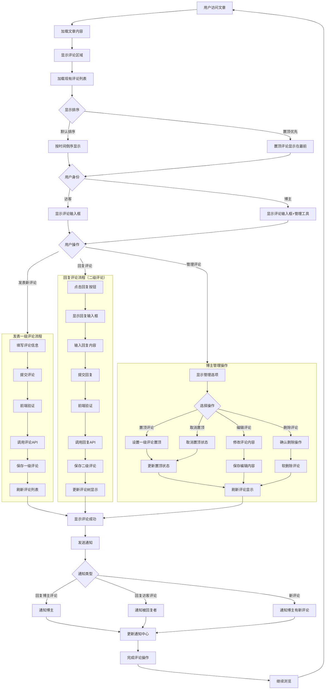

#### 搜索功能流程

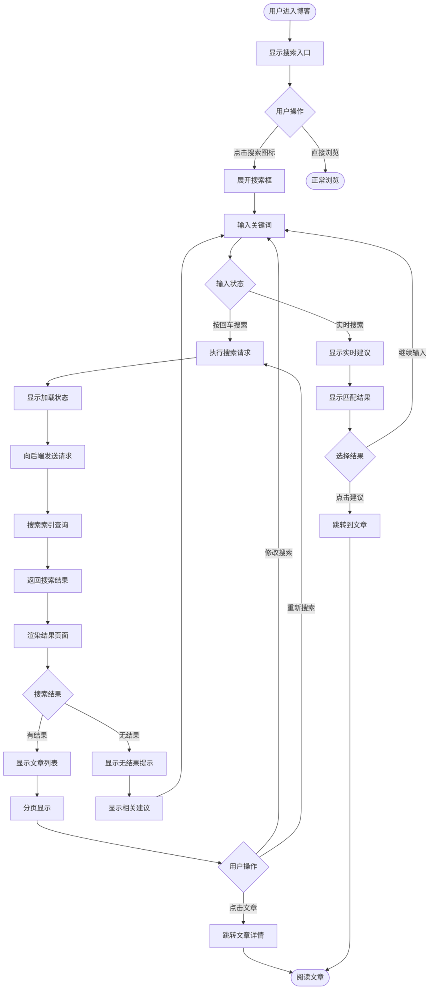

#### 用户鉴权流程


### 主要功能状态图

#### 文章生命周期状态

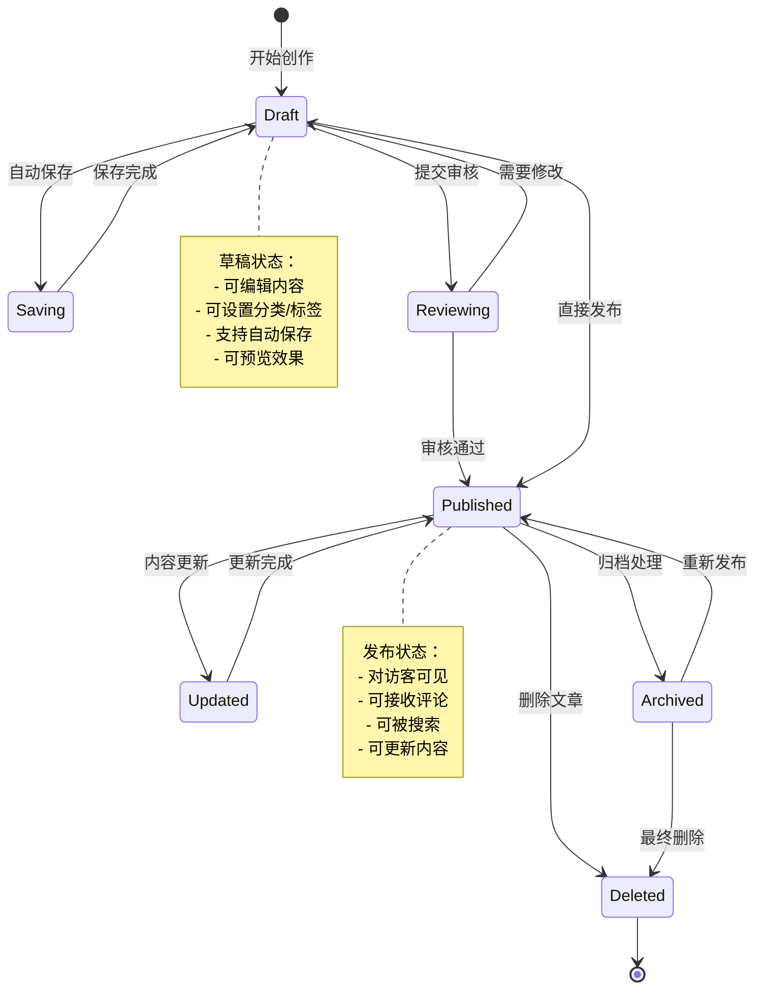

#### 评论系统状态

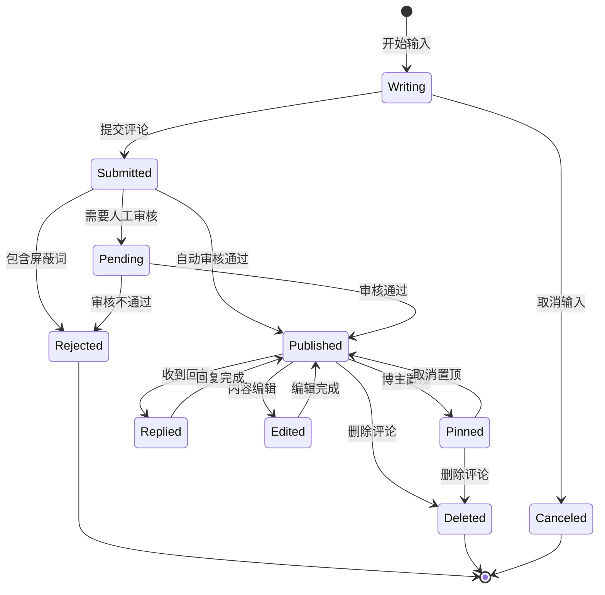

#### 用户认证状态

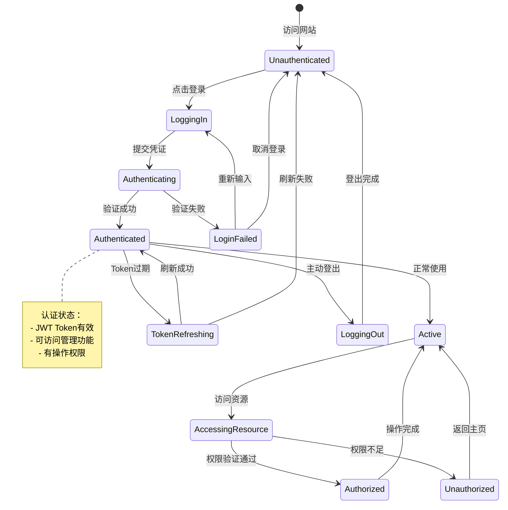

#### 系统运行状态

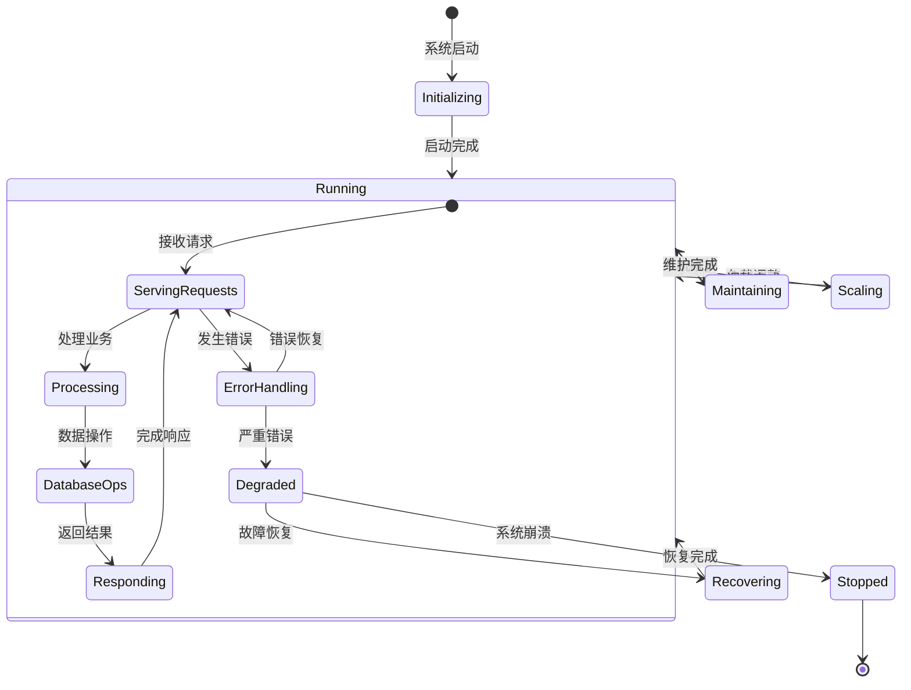

#### 搜索功能状态

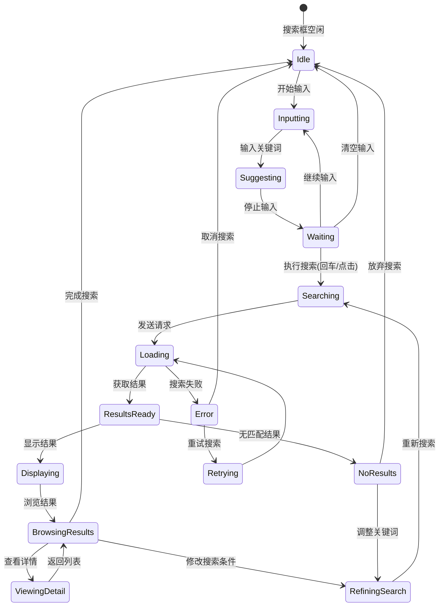

#### 文件上传状态

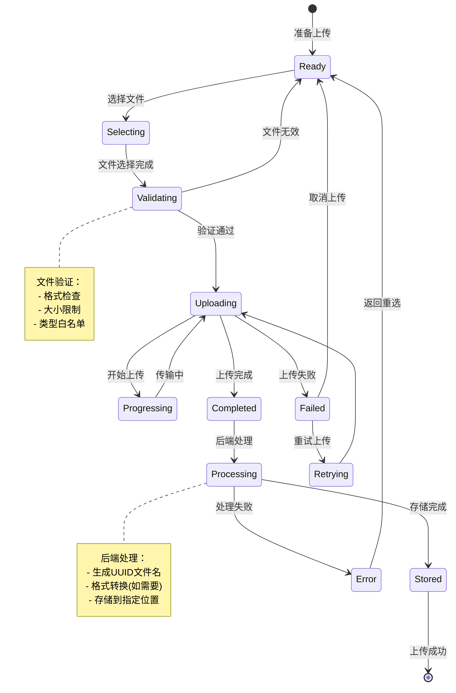

#### 数据缓存状态

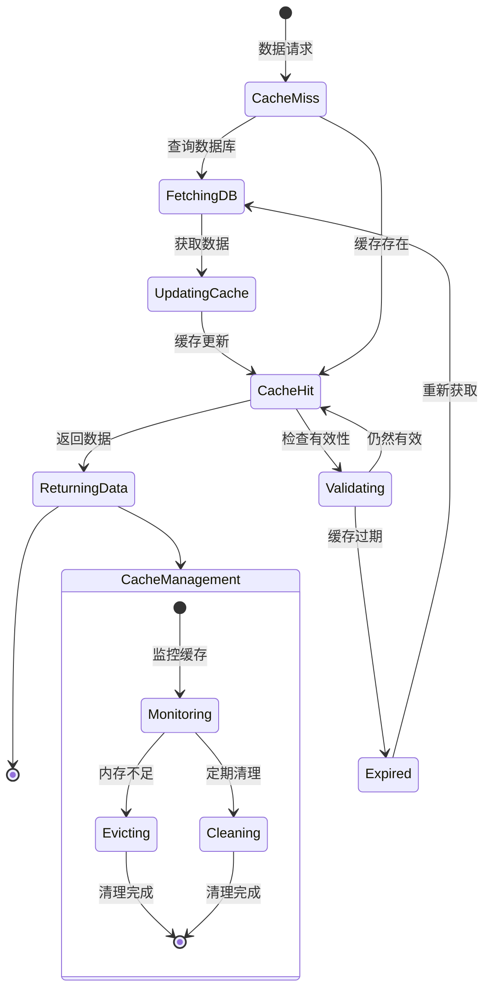

#### 用户权限控制流程

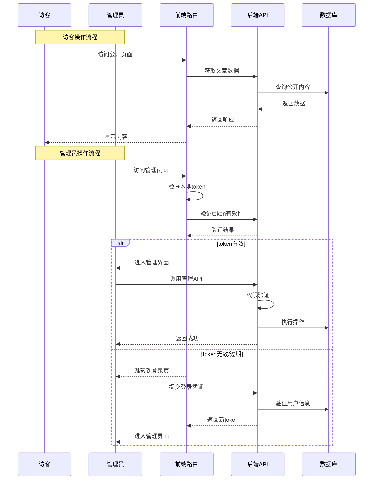

### 数据模型关系图

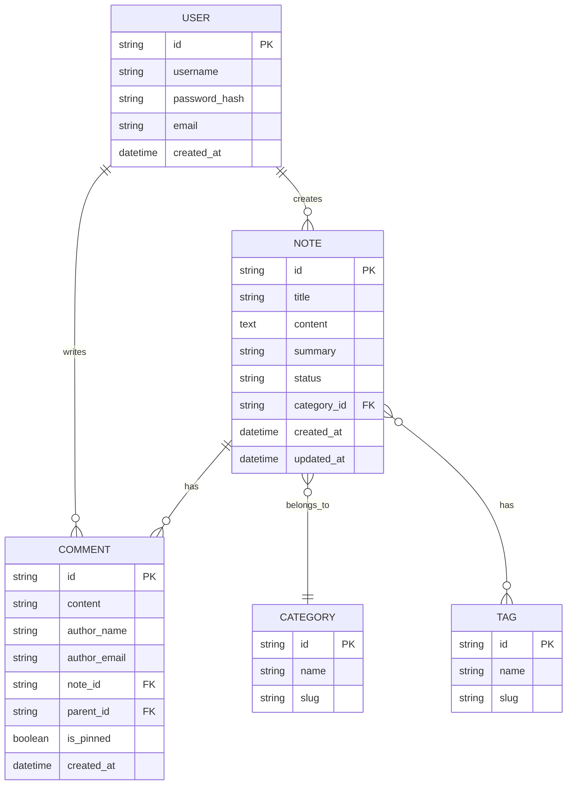