# Sajuna Blog 开发文档

**2025年9月25日**

---

## 一、项目概述

本项目是一个个人博客项目，旨在构建一个个人 Web 站点，采用现代化的开发流程进行项目构建。同时，在 AI Coding 的帮助下拓展对不同技术栈的了解。

## 二、部署说明

本项目使用 Docker 进行容器化部署，采用前后端分离架构设计：

- **前端**：使用 Vue3 框架，采用响应式设计适配移动端，在 [localhost:3000](http://localhost:3000) 端口上进行开发
- **后端**：使用 Go + Tars 微服务框架 + GORM，通过 TarsGateway 提供 HTTP API 服务，在 [localhost:8080](http://localhost:8080) 上运行
- **数据库**：使用 [MySQL](http://localhost:3306) + [Redis](http://localhost:6379)
- **网关**：使用 [Nginx](http://localhost:80) 进行反向代理

### 前端技术栈

前端采用 Vue 进行开发，致力于为用户提供一个友好且高效的交互式网页界面。

| 技术栈 | 说明 |
|--------|------|
| Vue 3 | 采用 Composition API 提升组件复用性与逻辑组织能力 |
| Vuex 4.x | 全局状态管理 |
| Vue Router 4.x | 实现灵活的页面路由控制 |
| Element Plus UI 组件库 | 丰富的 UI 组件支持 |
| Sass/SCSS 预处理器 | 增强 CSS 开发能力 |
| Axios | HTTP 通信 |
| WebSocket + STOMP.js | 实现消息的即时推送与接收 |

### 后端架构

后端基于 Tars 微服务框架，使用 TarsGateway 作为 API 网关，提供统一的 HTTP 接口。TarsGateway 负责请求路由、负载均衡、限流熔断等功能。系统通过 Tars 框架实现服务注册发现、监控管理等功能。

### 底层服务

底层依托以下技术栈构建：

- **MySQL**：核心数据存储
- **Redis**：缓存相关数据，提升系统性能
- **MinIO**：提供分布式文件存储服务
- **Kafka**：作为消息队列支撑 Chatservice 的高并发消息分发，保证即时通讯稳定性与可扩展性

整体系统具备良好的模块解耦、水平扩展与高可用能力，可支持用户规模增长下的稳定运行，满足知识管理平台在实际应用中的业务需求。

## 三、需求描述

### 目标用户

- **主要用户（管理员/博主）**： 自己，负责内容创作、发布、管理和维护博客。

- **次要用户（访客）**： 博客的 reader 。可以浏览内容、发表评论。

---

### 用户角色与画像

| 角色 | 核心目标 | 使用场景 |
| :--- | :--- | :--- |
| **访客** | 1. 便捷地查找和阅读感兴趣的博文。 2. 了解博主的基本信息。 3. 对文章发表评论或提问。 | 通过搜索引擎或直接访问进入博客，浏览首页、文章列表，阅读具体文章，进行评论。 |
| **博主（管理员）** | 1. 高效地撰写、编辑、发布和删除文章。 2. 管理博客的评论内容，维护社区氛围。 3. 管理文章的分类和标签，使内容结构化。 4. 确保博客的安全稳定运行。 | 登录后台管理界面，创作新的 Markdown 文章，管理已发布的内容，审核或删除不当评论。 |

### 功能需求

功能需求描述系统必须提供的具体功能。

#### 访客端功能

*   **F1: 内容浏览模块(Note)**
    *   **F1.1 首页(Homepage)**： 展示blog简介、最新文章列表、热门文章推荐等。
    *   **F1.2 文章列表页(NoteList)**： 分页展示所有文章，可按分类、标签或发布日期（归档）进行筛选。
    *   **F1.3 文章详情页(NoteDetail)**： 完整展示文章标题、作者、发布时间、正文（支持 Markdown 渲染和代码高亮）、分类、标签。
    *   **F1.4 关于页面(About)**： 展示博主的详细介绍、社交链接等。
    *   **F1.5 搜索功能（Search）**： 在全站文章中进行关键词搜索，并展示结果列表。

*   **F2: 互动模块(Communicate)**
    *   **F2.1 评论功能(Comment)**： 博主或访客可以在文章底部发表评论（可支持回复一级评论的二级评论），博主能够置顶一级评论。
    *   **F2.2 评论通知(Notice)**： 当博主或访客回复了博主或访客的评论时，在站点内通知评论者。

#### 管理端功能

*   **F3: 身份认证模块(Auth)**
    *   **F3.1 登录/登出**： 博主通过用户名和密码登录后台管理系统。

*   **F4: 内容管理模块（ContentManage）**
    *   **F4.1 文章管理（CRUD）(NoteManage)**：
        *   **创建(CreateNote)**： 提供富文本或 Markdown 编辑器（**强烈推荐 Markdown**）撰写新文章，支持设置标题、摘要、分类、标签，添加文件（图片base64编码；文件名使用uuid），文件预览（格式自动解析）等。
        *   **读取(Read)**： 在后台列表中查看所有文章及其状态（已发布、草稿）。
        *   **更新(Update)**： 编辑已存在文章的内容和元信息。
        *   **删除(Delete)**： 将文章移至垃圾箱或永久删除（建议支持软删除）。
    *   **F4.2 分类/标签管理(TagManage)**： 可创建、编辑、删除文章的分类和标签。

*   **F5: 评论管理模块(CommentManage)**
    *   **F5.1 评论删除(Delete)**： 所有访客评论无审核自动通过（后续可能会添加屏蔽词的扩展），博主可删除。
    *   **F5.2 评论列表(List)**： 查看所有文章的评论，可进行**批准、回复、编辑、删除**操作。

#### 全局功能

*   **F6: 系统仪表盘(Dashboard)**
    *   **F6.1 数据统计(DataList)**： 展示基本数据，如文章总数、评论总数、近期访问量等。

### 非功能需求

*   **N1: 性能**
    *   **页面加载速度**： 首屏加载时间应小于 1.5 秒（基于 Lighthouse 评分标准）。
    *   **API 响应速度**： 95% 的 API 请求响应时间应在 100ms 以内。
    *   **并发支持**： 应能支持至少 50 个并发用户同时浏览（对于个人博客完全足够）。

*   **N2: 安全性**
    *   **后端**： 防止 SQL 注入、XSS 攻击、CSRF 攻击等常见 Web 安全威胁。
    *   **认证**： 用户密码需加盐哈希存储（bcrypt）。JWT Token 应有合理的过期时间（20min）。
    *   **权限**： 前后端均需对管理接口进行鉴权，未登录用户无法访问管理端功能。
    *   **输入验证**： 前后端均需对用户输入进行严格校验，优先使用白名单策略。

*   **N3: 可用性**
    *   **前端**： 界面设计简洁、直观，导航清晰。支持响应式布局，在手机、平板、桌面设备上均有良好体验。
    *   **后台**： 管理流程顺畅，Markdown 编辑器易用，文章发布流程简单。

*   **N4: 可靠性**
    *   **系统可用性**： 目标 99.9% 的可用性。
    *   **数据持久性**： 确保文章、评论等核心数据不丢失

*   **N5: 可维护性与可扩展性**
    *   **代码质量**： 代码结构清晰，注释完备，遵循编程规范。
    *   **模块化**： 前后端均采用模块化/组件化设计，便于后续功能扩展（如新增“友链”页面、图床功能等）。

#### 5. 内容管理需求

*   **写作体验**： 支持 Markdown 语法是核心需求，并提供实时渲染预览功能。
*   **媒体支持**： 支持在文章中上传和嵌入图片。

#### 总结与优先级建议

| 优先级 | 需求 | 说明 |
| :--- | :--- | :--- |
| **P0 (必须实现)** | 访客：文章浏览、列表、详情 博主：登录、文章CRUD、分类标签管理 | 构成博客最核心的功能。 |
| **P1 (应该实现)** | 访客：搜索、评论 博主：评论管理、Markdown编辑器 | 提升博客的可用性和互动性，是完整博客体验的关键。 |
| **P2 (可以实现)** | 系统仪表盘、评论回复通知、文章草稿自动保存、友情链接页面 | 在核心功能稳定后迭代增加。 |

## 四、模块和关系

### 博客系统整体架构图

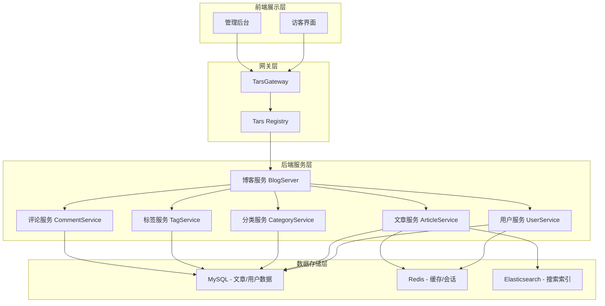

### 流程图

#### 访客浏览文章流程

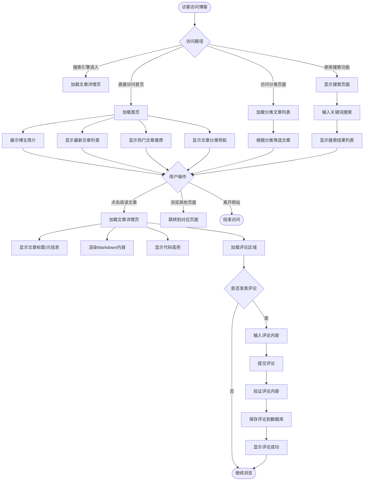

#### 管理员文章CRUD操作流程

#### 评论系统流程

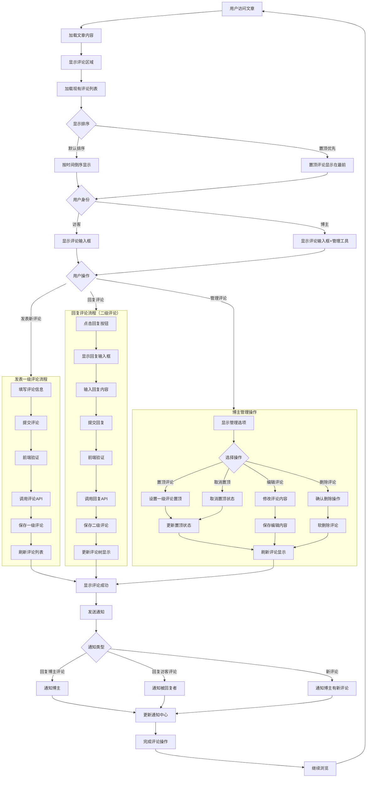

#### 搜索功能流程

#### 用户鉴权流程

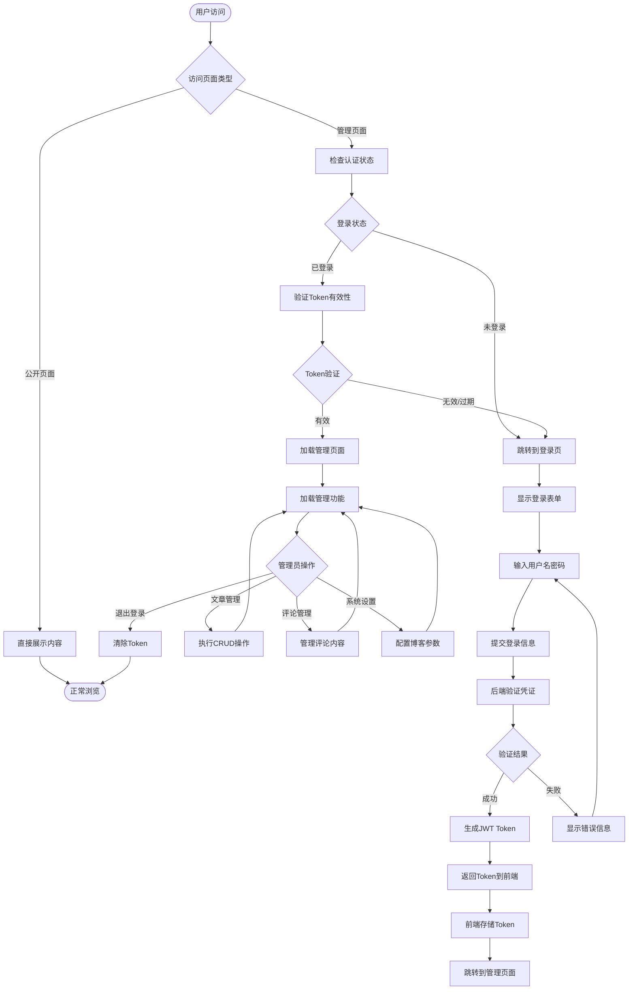

### 主要功能状态图

#### 文章生命周期状态

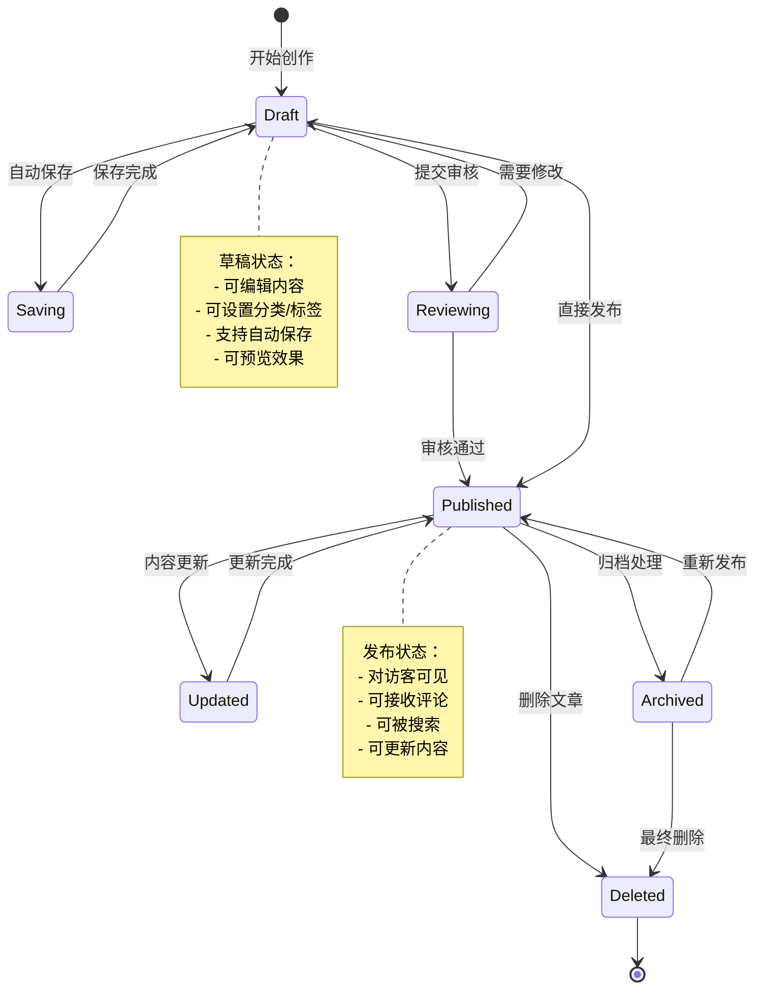

#### 评论系统状态

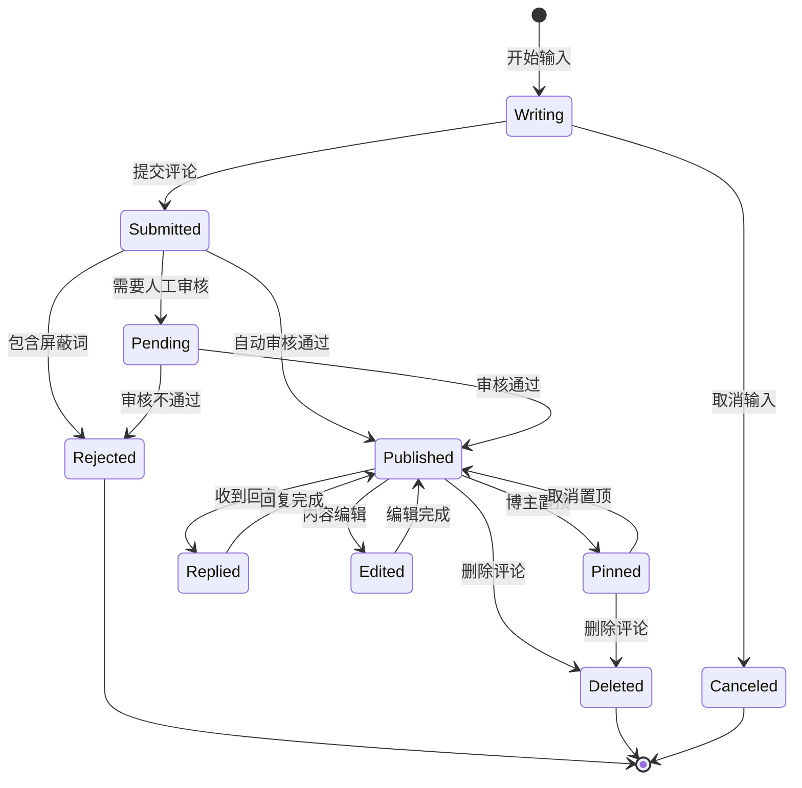

#### 用户认证状态

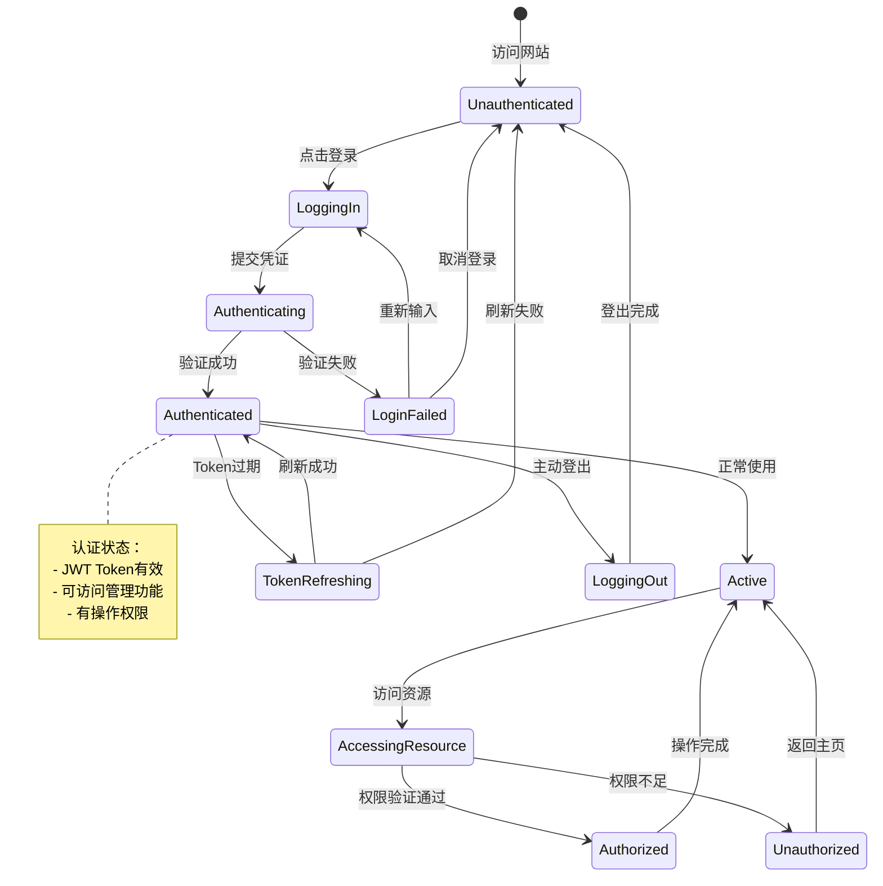

#### 系统运行状态

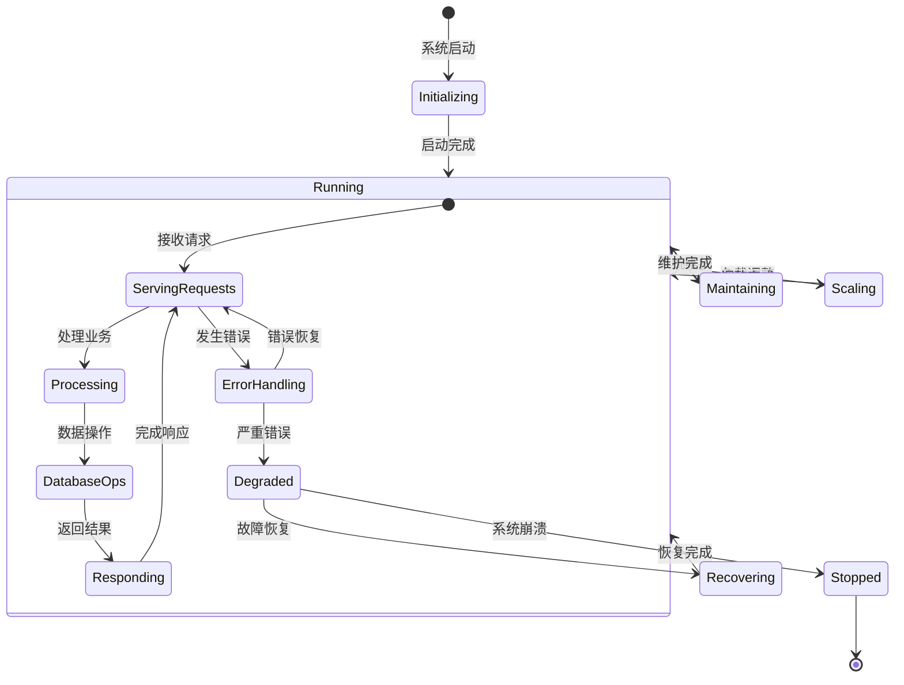

#### 搜索功能状态

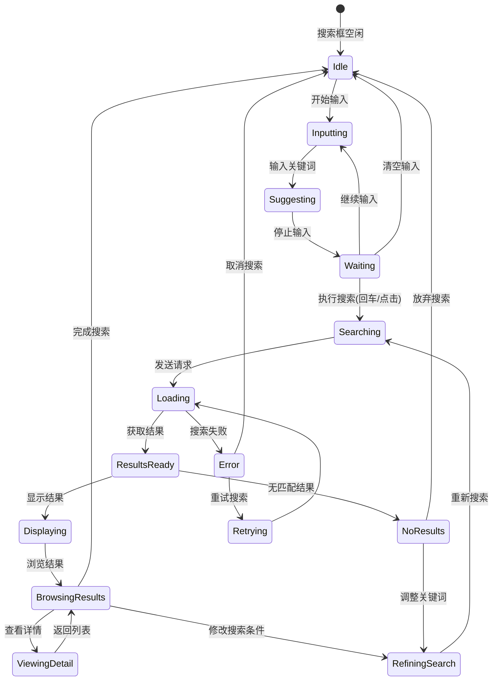

#### 文件上传状态

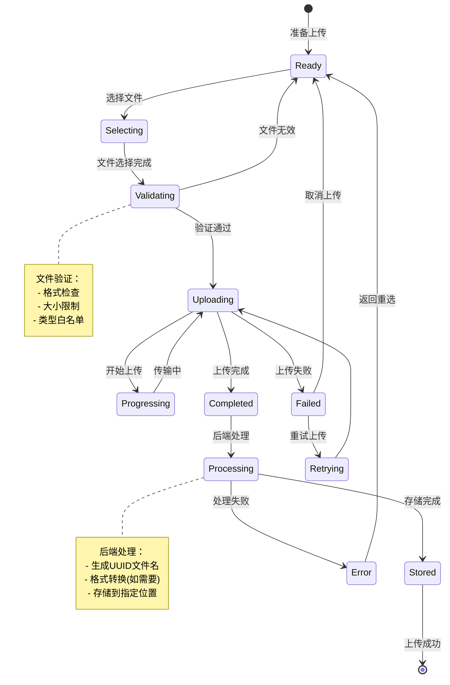

#### 数据缓存状态

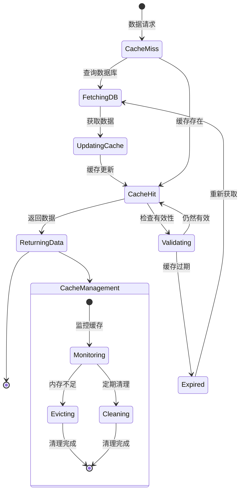

#### 用户权限控制流程

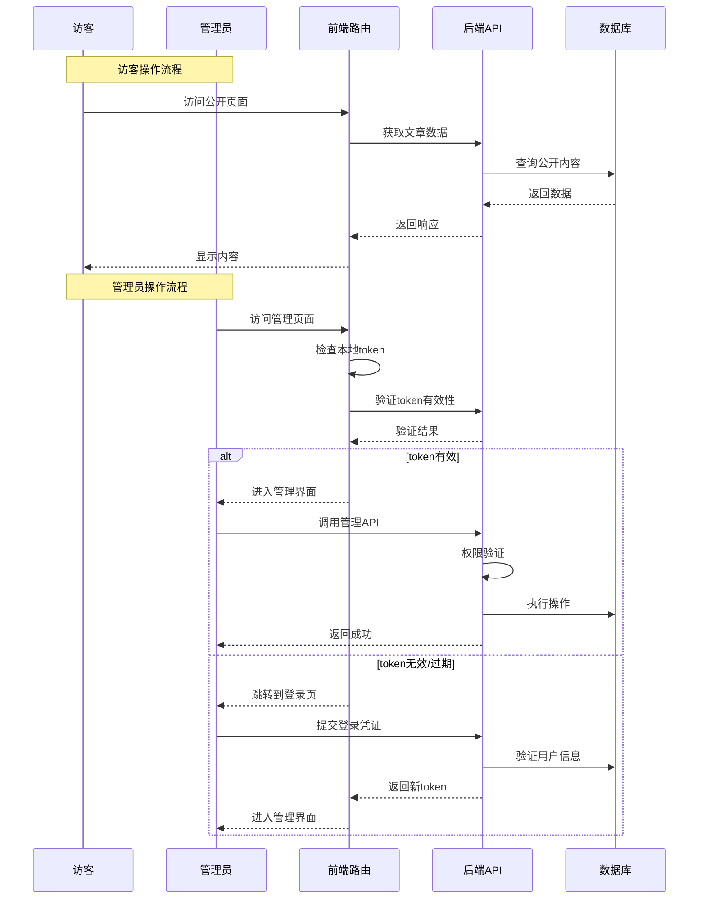

### 数据模型关系图

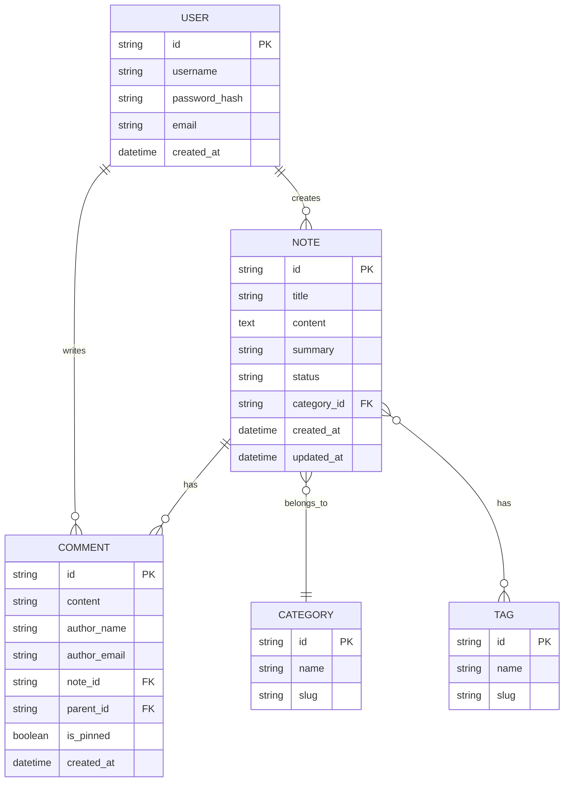
